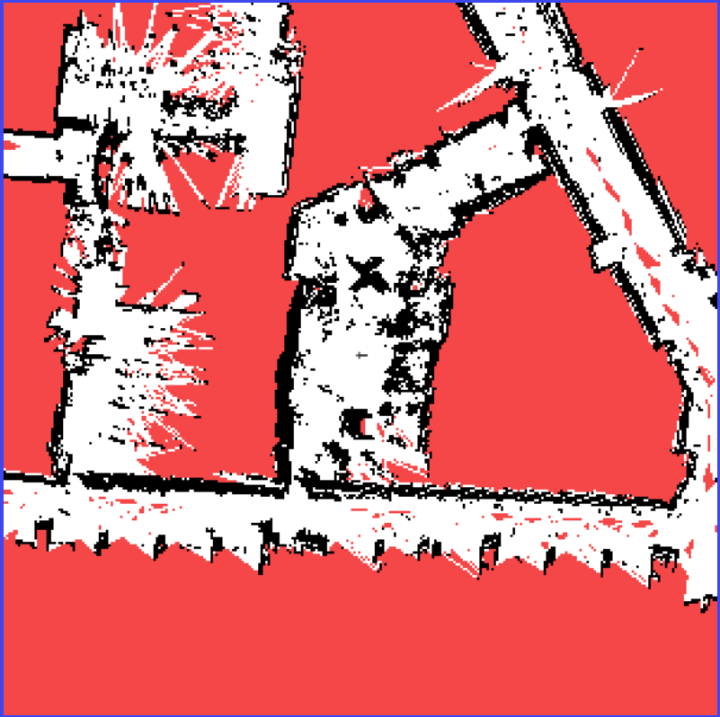
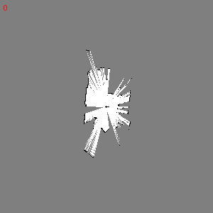

# EW458-Final-Project-2025: Create3 Robot LIDAR Mapping


## Install Dependencies

Clone repository:
```
https://github.com/odoy25/EW458-Final-Project.git
```
roslibpy:
```
pip install roslibpy 
```
deque:
```
pip install deque
```
Visual Occupancy Map (Connect to Common Local Network):
```
http://192.168.8.104:8080/map.html
```
## Overview

Our Firsty Team designed an integrated ROS2 python script that subscribes and publishes to a create3 robot in order to produce an ocupancy map. 

Internal Odometry and LIDAR scan messages are subscribed from the create3 and sent over a LAN network to a computer node. Visual Studio Code proccess these messages, calculates, creates and then publishes a ROS Occupancy message to the robot. 

The map can be viewed online through the robot's IP address and map topic while the node is connected to the same network.

The map displays a 2D image with obstacles (black), free-space (white), and unknown (red). A grey dot (cross) is displayed to represent the robot's current locaiton. 



## What is an Occupancy Map?


## TG30 LIDAR 


## How Code Works


