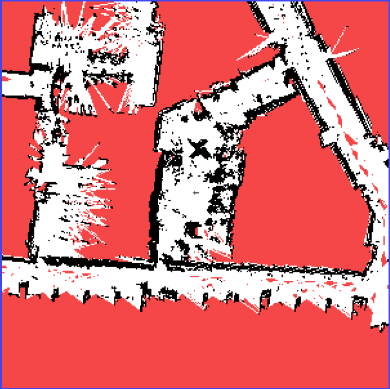
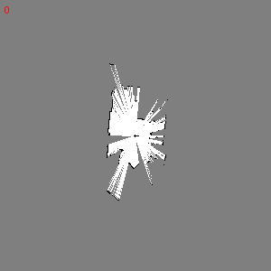

# EW458-Final-Project-2025: Create3 Robot LIDAR Mapping


## Install Dependencies

Clone repository:
```
https://github.com/odoy25/EW458-Final-Project.git
```
roslibpy:
```
pip install roslibpy 
```
deque:
```
pip install deque
```
Visual Occupancy Map (Connect to Common Local Network):
```
http://192.168.8.104:8080/map.html
```
## Overview

Our Firsty Team designed an integrated ROS2 python script that subscribes and publishes to a create3 robot in order to produce an ocupancy map. 

Internal Odometry and LIDAR scan messages are subscribed from the create3 and sent over a LAN network to a computer node. Visual Studio Code proccess these messages, calculates, creates and then publishes a ROS Occupancy message to the robot. 

The map can be viewed online through the robot's IP address and map topic while the node is connected to the same network.

The map displays a 2D image with obstacles (black), free-space (white), and unknown (red). A grey dot (cross) is displayed to represent the robot's current locaiton. 



## What is an Occupancy Map?


## TG30 LIDAR 


## How Code Works

This program builds and publishes a real-time occupancy grid map showing obstacles (occupied), free space, and unknown areas as the robot moves and scans its environment.

ROS Connection: Connects to a robot via WebSocket using roslibpy.

Subscriptions:

/odom: For the robot's position and orientation.

/scan: For LIDAR (laser scan) data.

Publishes: A map to a topic (e.g. /juliet/mapmike) as an OccupancyGrid.

The mapping process works by combining the robot’s laser scan and odometry data to build a real-time 2D occupancy grid. First, the robot's pose (position and orientation) is tracked using odometry data, and the LIDAR scan data is time-synchronized with this pose using interpolation to ensure accuracy. Each LIDAR beam is transformed into world coordinates to identify where obstacles are detected. As each beam travels from the robot to a detected object, Bresenham’s algorithm is used to mark the cells it passes through as free, and the final cell where the obstacle is hit is marked as occupied. To account for noise and uncertainty, each map cell keeps track of how many times it's been hit or missed, and only updates its status when certain confidence thresholds are reached. This process creates a probabilistic occupancy grid that continuously updates as the robot explores, with the robot’s position and heading also drawn onto the map for context.

The GIF below shows how the map is being updated over time as the robot drives around Hopper.


