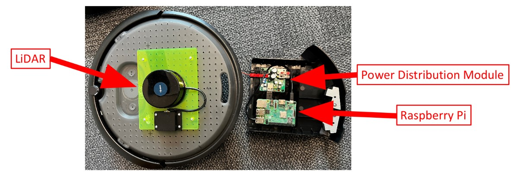

# EW458-Final-Project-2025: Create3 Robot LIDAR Mapping


## Install Dependencies

Clone repository:
```
https://github.com/odoy25/EW458-Final-Project.git
```
roslibpy:
```
pip install roslibpy 
```
deque:
```
pip install deque
```
Visual Occupancy Map (Connect to Common Local Network):
```
http://192.168.8.104:8080/map.html
```
## Overview

Our Firstie Team designed an integrated ROS2 python script that subscribes and publishes to a create3 robot in order to produce an ocupancy map. 

Internal Odometry and LIDAR scan messages are subscribed from the create3 and sent over a LAN network to a computer node. Visual Studio Code proccess these messages, calculates, creates and then publishes a ROS Occupancy message to the robot. 

The map can be viewed online through the robot's IP address and map topic while the node is connected to the same network.

The map displays a 2D image with obstacles (black), free-space (white), and unknown (red). A grey dot (cross) is displayed to represent the robot's current locaiton. 


## What is an Occupancy Map?
In order for an unmanned system to navigate through an environment, it must have an understanding of what obstacles or other features might lie in its path. Typically this information is displayed on a map. Figuring out where that system lies on a map without outside help like GPS is a process known as **localization**. The standard map used for localization with robotics and their navigation is called an **Occupancy Grid**.

An Occupancy Grid divides a space into small squares (in 2D) or cubes (in 3D), each referred to as a cell. Each cell is assigned a numerical value to represent a feature of the environment, in this case whether it is free space (0), occupied by an obstacle (100), or unknown (-1). The system’s odometry provides an estimate of its position, which is used to build the map over time. LiDAR measurements are also incorporated, which provide data on the location of obstacles relative to the robot’s frame of reference. For each LiDAR measurement, the obstacle’s location is calculated in the odometry reference frame, and the nearest cell is assigned a value if it achieves a high probability of fulfulling one of the listed values. 

At the beginning of the trial, all cells are unknown (-1). As the vehicle continues to move and gather more sensor data, the occupancy grid is continually updated until the environment is entirely mapped, now incorporting free or occupied space,  allowing for future navigation and path planning.

## TG30 LIDAR 

The YDLidar TG30 is a 360-degree laser scanner that measures distances from 0.1 m to 30 m with a minimum angle resolution of 0.13 degrees. It updates at about 7 Hz, with data collected at different angles relative to the sensor. The Raspberry Pi reads this data from the LiDAR and publishes it to the ROS2 network on the /robotName/scan topic, where it’s packaged in a sensor_msgs/LaserScan message. The Raspberry Pi and LiDAR are powered by a power module, and the Raspberry Pi is mounted in the robot’s storage tray.




## How It Works

This program builds and publishes a real-time occupancy grid map showing obstacles (occupied), free space, and unknown areas as the robot moves and scans its environment.

ROS Connection: Connects to a robot via WebSocket using roslibpy.

Subscriptions:

/odom: For the robot's position and orientation.

/scan: For LIDAR (laser scan) data.

Publishes: A map to a topic (e.g. /juliet/mapmike) as an OccupancyGrid.

The mapping process works by combining the robot’s laser scan and odometry data to build a real-time 2D occupancy grid. First, the robot's pose (position and orientation) is tracked using odometry data, and the LIDAR scan data is time-synchronized with this pose using interpolation to ensure accuracy. Each LIDAR beam is transformed into world coordinates to identify where obstacles are detected. As each beam travels from the robot to a detected object, Bresenham’s algorithm is used to mark the cells it passes through as free, and the final cell where the obstacle is hit is marked as occupied. To account for noise and uncertainty, each map cell keeps track of how many times it's been hit or missed, and only updates its status when certain confidence thresholds are reached. This process creates a probabilistic occupancy grid that continuously updates as the robot explores, with the robot’s position and heading also drawn onto the map for context.

The GIF below shows how the map is being updated over time as the robot drives around Hopper.


